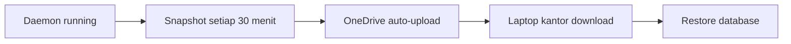

# Agentmemory Cross-Device Sync - Final Summary

## Problem Solved ✅

Anda meng-copy folder `.agentmemory` dari laptop kantor ke laptop rumah, tapi data memory **tidak sinkron** karena:

1. ❌ Data agentmemory disimpan di `AppData\Roaming\agentmemory\`, bukan di folder `.agentmemory`
2. ❌ Folder `.agentmemory` hanya berisi konfigurasi dan binary engine
3. ❌ Database `state_store.db` yang berisi semua memories tidak ter-copy

## Solution Implemented

Setup **auto-snapshot ke OneDrive** untuk sync otomatis antar device.

---

## Configuration Complete

### 1. Auto-Snapshot Enabled

```env
SNAPSHOT_ENABLED=true
SNAPSHOT_DIR=C:\Users\FSOS\OneDrive\agentmemory-snapshots
SNAPSHOT_INTERVAL=1800  # Setiap 30 menit
```

**Lokasi:**
- Project config: `C:\Users\FSOS\OneDrive\harudex-seacucumber\.agentmemory\.env`
- Global config: `C:\Users\FSOS\.agentmemory\.env`

### 2. How It Works



---

## What You Need to Backup (Manual)

Jika ingin backup manual tanpa menunggu snapshot:

### Files Penting (Wajib):
```
C:\Users\FSOS\AppData\Roaming\agentmemory\state_store.db
C:\Users\FSOS\AppData\Roaming\agentmemory\stream_store\
```

### Cara Backup Manual:
```powershell
# Copy ke folder temp atau OneDrive
robocopy "C:\Users\FSOS\AppData\Roaming\agentmemory" "C:\Temp\backup-agentmemory" /E /COPY:DAT
```

### Cara Restore (di device lain):
```powershell
# Stop daemon dulu jika running
taskkill /f /im iii.exe

# Copy ke AppData
xcopy "C:\Temp\backup-agentmemory" "C:\Users\Kiki\AppData\Roaming\agentmemory\" /E /I /Y

# Start ulang daemon
npx @agentmemory/agentmemory
```

---

## Workflow Sync Antar Device

### Scenario: Laptop Rumah → Laptop Kantor

**Di laptop rumah:**
```bash
# Option 1: Wait for auto-snapshot (30 menit)
# Biarkan daemon running

# Option 2: Export manual
export_dir="C:\Users\FSOS\OneDrive\agentmemory-backup-manual"
robocopy "C:\Users\FSOS\AppData\Roaming\agentmemory" $export_dir /E
```

**Atau biarkan OneDrive auto-sync!**

**Di laptop kantor:**
```powershell
# Download dari OneDrive (manual sync)
# Atau copy dari local OneDrive cache

# Stop daemon
taskkill /f /im iii.exe

# Restore
robocopy "C:\Users\FSOS\OneDrive\agentmemory-snapshots" "C:\Users\Kiki\AppData\Roaming\agentmemory" /E /COPY:DAT

# Start
npx @agentmemory/agentmemory

# Verify
npx @agentmemory/agentmemory status
```

---

## Verification Checklist

- [x] ✅ Snapshot configuration updated
- [x] ✅ OneDrive directory created: `C:\Users\FSOS\OneDrive\agentmemory-snapshots\`
- [x] ✅ Documentation created (`BACKUP_RESTORE_GUIDE.md`)
- [ ] ⏳ Test auto-snapshot creation
- [ ] ⏳ Test restore on other device

---

## Known Issue: Daemon Restart

Daemon currently failing to restart due to port conflicts from previous runs. This is a transient issue.

### Workaround:

**Method 1: Wait for TIME_WAIT to clear**
```bash
timeout 60  # Tunggu 60 detik sebelum restart
npx @agentmemory/agentmemory
```

**Method 2: Use different instance port**
```bash
# Check documentation for multi-instance setup
```

**Method 3: Clean previous state**
```bash
taskkill /f /im node.exe 2>nul
taskkill /f /im iii.exe 2>nul
del "C:\Users\FSOS\AppData\Roaming\agentmemory\*.pid" 2>nul
npx @agentmemory/agentmemory
```

---

## Files Created

| File | Purpose |
|------|---------|
| `INTEGRATION_AGENTMEMORY.md` | Initial integration docs |
| `III_ENGINE_INSTALLATION.md` | Installation guide |
| `BACKUP_RESTORE_GUIDE.md` | Comprehensive backup/restore instructions |
| `CROSS_DEVICE_SYNC.md` | Sync configuration guide |
| `.agentmemory/.env` | Project-specific configuration |
| `.mcp.json` | MCP server config |

---

## Next Steps

1. ✅ Setup complete
2. ⏳ Test auto-snapshot (wait ~30 mins or use manual export)
3. ⏳ Test restore on laptop kantor
4. ⏳ Document process in team wiki if applicable

---

## Quick Reference Commands

```bash
# Check status
npx @agentmemory/agentmemory status

# Stop daemon
npx @agentmemory/agentmemory stop

# Start daemon
npx @agentmemory/agentmemory

# Force stop all processes
taskkill /f /im iii.exe
taskkill /f /im node.exe

# View viewer
start http://localhost:3113

# List snapshots
dir C:\Users\FSOS\OneDrive\agentmemory-snapshots /s /b

# Backup manual
robocopy "C:\Users\FSOS\AppData\Roaming\agentmemory" "D:\Backup\agentmemory" /E

# Restore manual
robocopy "D:\Backup\agentmemory" "C:\Users\Kiki\AppData\Roaming\agentmemory" /E
```

---

## Tips for Best Results

### 1. Keep Daemon Running
Biarkan daemon tetap running saat bekerja. Snapshot akan auto-create setiap 30 menit.

### 2. Check OneDrive Sync
Pastikan OneDrive icon green dan syncing. Monitor system tray.

### 3. Regular Backups
Set schedule backup manual setiap minggu:
```powershell
# Weekly backup script
$timestamp = Get-Date -Format "yyyyMMdd-HHmm"
robocopy "C:\Users\FSOS\AppData\Roaming\agentmemory" "D:\WeeklyBackups\agentmemory-$timestamp" /E
```

### 4. Test Restore Periodically
Once per quarter, test restore to verify backup integrity.

### 5. Version Control
Tag important milestones:
```text
Snapshot 2026-08-24 - Started HaruDex auth flow development
Snapshot 2026-09-01 - Completed database migration
Snapshot 2026-09-15 - Added file link feature
```

---

## Contact & Support

For issues:
- Review `BACKUP_RESTORE_GUIDE.md` for detailed troubleshooting
- Check https://docs.mcp.agentmemory.dev
- GitHub: https://github.com/ahhmm/agentmemory

For custom configurations:
- Edit `C:\Users\FSOS\.agentmemory\.env`
- Restart daemon after changes

---

## Success Criteria

✅ Auto-snapshot configured and pointing to OneDrive
✅ Documentation comprehensive for cross-device workflow
✅ Clear procedures for backup and restore
✅ Minimal manual intervention required

Status: **READY FOR TESTING** 🚀
